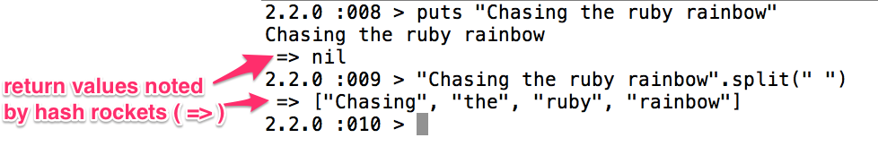

# Classes and Inheritance

At a high level, when we write ruby, we deal largely with classes and objects.

### Objectives

* Describe difference between objects and classes
* Draw how objects are referenced
* Use getters and setters
* Understand `attr_writer`, `attr_reader`, `attr_accessor`
* Write instance variables and instance methods
* Understand class variables and class methods
* Recall the `self` keyword
* Describe `Protected`, `Private`, and `Public` methods
* Write code that enables method chaining in a class

`Classes` are _blueprints_ for `objects`. That is to say, classes define _how_
objects can behave. Objects are instances of classes, and classes define their
objects' behavior through methods.

Defining a class in Ruby always starts with the keyword class followed by the name
of the class. The name should always start with a capital letter. Two word classes
are defined in the _pascal case_ style, such as `class CarMechanic`.

At a high level, **classes** are used to group and organize real world things.
We write software to solve real world problems, and we name things in our code
in a way that makes sense to talk about with both tech and non-tech people.
Naming things is hard, but as a general rule, we call things by what they are.
If its a bike, make a Bike **class**. This example is contrived, but you get
the point.

By default, ruby comes with several built in classes, such as _arrays_, _strings_,
_hashes_, and _symbols_. Each of these classes have their own predefined sets of
**behaviors** or **methods**. You can view these predefined methods and read more
about these **classes** in the ruby docs.

-  http://www.ruby-doc.org/core-2.2.0/Array.html
-  http://www.ruby-doc.org/core-2.2.0/Hash.html
-  http://www.ruby-doc.org/core-2.2.0/String.html
-  http://www.ruby-doc.org/core-2.2.0/Symbol.html

Like I briefly mentioned earlier, in **ruby**, we can also define our own
**classes**. We can define these **classes** with **attributes** and
**behaviors** or **methods**.

If we were to group the organization of our classroom into ruby **classes**,
we could group students into a Student **class**, and instructors into an Instructor
**class**. You as an individual (that is, you the student) would be an instance
of the Student **class**, and you would share a list of common behaviors or
**methods** with your fellow students. These **methods** are defined in the
**class** itself.

You, the individual, would be an **object**, or an **instance** of the Student
**class**. You maintain your own individual state, yet share a list of available
**methods** or **behaviors**. That is to say, you have your own unique name,
yet share the ability to speak your name out loud. If we translated this into code,
it may look something like this:

```ruby
class Student
  def initialize(name)
    @name = name
  end

  def speak_name
    puts "My name is " + @name
  end
end

alice = Student.new('Alice')
alice.speak_name
# "My name is Alice"

george = Student.new('George')
george.speak_name
# My name is George"
```

Alice and George are both instances of the Student **class**. While they maintain a different state (they have different names), they share the same behavior in that they can both speak their name. So, we have a Student **class**, **instances** of the Student **class** in Alice and George, and a shared **behavior** between the two instances through the `.speak_name` method. It is also important to note that each student's name is stored as a _string_, which is a ruby **class** we will work extensively with.

Keep in mind that _every_ method in **ruby** returns _something_, and everything in ruby is an **object** and has a **class**. Again _everything_ in ruby is an **object** (well, pretty much at least)! In other words, every bit of code can be given its own properties and actions. If you are ever curious what a **method** _returns_, here is an image that may help.



While the `puts` method _prints_ a _string_ to the terminal screen,
it ultimately _returns_ nil (even nil is an object! It is of the `NilClass` **class**).
There is no magic to `.puts`, its just a **method**, and it is just acting in accordance
to its defined **behavior**. I don't know if it puts its pants on one leg at a time
like the rest of us, but under the hood, its defined like all other methods.

The `.puts` method is defined like this, look familiar?

```ruby
# Calls #print on each element in the given +objs+, followed by a newline
# character.
def puts(*objs)
  for obj in objs
    print(*obj)
    print "\n"
  end
end
```

There is no magic here, just **ruby**.

Still referring to the image above, the `.split` method, is a method on the
**string class**, and it returns an **array object**, and each element in the
array is a **string object**.

Knowing an object's class is helpful when solving problems. Thankfully, **Ruby**
is nice enough to provide us with a `.class` **method** that is shared amongst
_all_ ruby **objects**. If you are ever confused with what **class** of **object**
you are working with, just ask ruby with this method.

Get used to dealing with all sorts of **classes** and **objects** in Ruby.

## First Class

Let's create our first class.


`person.rb`

```ruby
class Person

end
```

This defines a **class** definition of a `Person`. The *class* keyword denotes
the *begining* of a class Definition.

To create a new *instance* of our *class* we write the following:

	> Person.new()

A particular instance of a *class* is a called an **object**. In general,
languages that use *objects* as a primary means of *data abstraction* are said
to be **Object Oriented Programming** (OOP) languages.

### Initialize and instance variables

In our class definition we can make use of an *initialize* method,
which is run every time a *new* instance of the class is created.

```ruby
class Person
  def initialize
    puts "A new person was created"
  end
end
```


We can also make use of **instance variables** that are defined for each
particular object and are available throughout other *methods* in the object.
These variables are prefixed by an *@* symbol, i.e. `@my_var`.

```ruby
class Person

  def initialize(name)
    @name = name
  end

  def greet
    puts "Hello! My name is #{@name}."
  end
end
```

Now, when we create a new *Person* we are required to specify the `name` of the person.

	> person = Person.new("John")
	> person.greet
	=> Hello! My name is John.

### Getters and Setters

Having created an *instance variable* in our object, we might want to *read* that
*outside* of our object. However, we have to define a method that will act as an
**interface for reading** for this variable called a **Getter Method**.

```ruby
class Person

  def intialize(name)
    @name = name
  end

  def name
    @name
  end

  ...
end
```

Now we can *read* or *get* the *name* outside the object.

	> person = Person.new("Jane")
	> person.name
	=> "Jane"

Similarly, we may need to *change* or *set* an instance variable from outside the
object, so we create a method called a **setter method**.

```ruby
class Person

  def initialize(name)
    @name = name
  end

  def name
    @name
  end

  def name=(other)
    @name = other
  end
  ...
end
```

We can now *get* and *set* the name of a person using the methods we created for `@name`.

	> person  = Person.new("Samantha")
	> person.name
	=> "Samantha"
	> person.name = "Sam"
	> person.name
	=> "Sam"

### attr_reader, attr_writer, attr_accessor

In ruby, the practice of creating a *getter* method is so common there
is a shorthand that can be used at the top of a class definition
called `attr_reader`.

```ruby
class Person
  attr_reader :name

  def initialize(name)
    @name = name
  end

  def name=(other)
    @name = other
  end
  ...
end
```

Similarly, we can do the same with the *setter* method using `attr_writer`

```ruby
class Person
  attr_reader :name
  attr_writer :name

  def initialize(name)
    @name = name
  end

  ...
end
```

Moreover, we have a shorthand for telling our class to create both a
*getter* and a *setter* method called *attr_accessor*.

```ruby
class Person
  attr_accessor :name

  def initialize(name)
    @name = name
  end
  ...
end
```

### self, class methods, and class_variables (@@)

Let's first create a variable associated with our class using the
`@@var_name` which designates a class variable. Then we we will add a
class method called `self.method_name` to return the value of our variable.

```ruby
class Person
  @@population = 0

  def initialize(name)
    @name = name
    @@population += 1
  end

  def self.population
    @@population
  end
end
```

If we create a few new people we see the following

	> Person.new("John")
	> Person.new("Jane")
	> Person.population
	=> 2

In most cases, inside an instance method, self refers to the Object, but when used in the context of a method name it refers to the *class* itself`.

You could also say

```ruby
class Person
  ...
  def Person.population
    @@population
  end
end
```

but this has the unfortunate problem of needing to be renamed if you ever rename your class.

# Exercises

## Create a book class
* books have a title, author, year
* you should not be able to change the year of the book, it should only be set when creating the new book
* you should be able to change everything else!

  * there should be an instance method called `describe_book`
    * this should return
      * "The author of @title is @author"

  * the book class should have the following class variables
    * library (is an array of book instances)
    * count (the number of book instances)

  * you should have a way to print out the library and the count

### BONUS
Write a class method that adds new information to the library array.

### Private and Protected Methods

Ruby allows us to define private and protected methods as well. Here is a quick difference:

- Protected methods can be called by any instance of the defining class or its subclasses.

- Private methods can be called only from within the calling object. You cannot access another instance's private methods directly.

If we create a class `Person` with a name attribute and use `attr_accessor` to create the getters and setters as follows:

```ruby
class Person
  attr_accessor :name

  def initialize(name)
    @name = name
  end
end
```

then anyone can read and access `Person#name`.

	> person1 = Person.new("John")
	> person1.name
	=> "John"

We can change this using the `private` keyword:

```ruby
class Person
  attr_accessor :name

  def initialize(name)
    @name = name
  end

  private
    def make_call
      puts "calling friends"
    end
end
```

This keyword will ensure that every method definition that comes after that keyword is creating a _private_ method. What happens when you try to call the make_call method on a new person?

Every other method defined is a _public_ method.

### Chainable methods

What if I wanted to create a class that had **chainable** methods calling many methods in one line.

```ruby
class Person
  def initialize(name)
    @name = name
  end

  def greet
    puts "Hello I am #{@name}."
    puts "What is your name?"
    @other = gets.chomp
    puts "Nice to meet you, #{@other}."
  end

  def thank
    puts "Thank you for coming."
  end

  def farewell
    puts "Farewell, #{@other}"
  end
end
```

Trying to do:

	> person1 = Person.new("john")
	> person1.greet.thank.farewell
	=> nil has no method `thank`

to achieve this we have to return a reference to the object after each method:

```ruby
class Person
  def initialize(name)
    @name = name
  end

  def greet
    puts "Hello I am #{@name}."
    puts "What is your name?"
    @other = gets.chomp
    puts "Nice to meet you, #{@other}."
    self
  end

  def thank
    puts "Thank you for coming."
    self
  end

  def farewell
    puts "Farewell, #{@other}"
    self
  end
end
```

	> person1 = Person.new("john")
	> person1.greet.thank.farewell
	Hello I am john.
	What is your name?
	Chris
	Nice to meet you, Chris.
	Thank you for coming.
	Farewell, Chris

## Class Inheritance

Inheritance is a generic programming concept that allows classes
to share a base set of code that provides shared behavior, while still allowing
for those classes to implement their own specific behavior where need be.

## Objectives
* Describe class inheritance
* Define a class in Ruby
* Describe each of the vocabulary terms noted below

## Guiding Questions
* What is inheritance?
* What does it mean to override a method?
* What is super? Give an example of how to use it.

## Vocabulary Terms

* superclass
* subclass
* general VS specific
* method overriding

## Method Overriding

Method overriding is when a subclass implements a method of the same name as a
method in the superclass. That is, a subclass provides its own, more specific
behavior than what is implemented in the superclass.

When a superclass provides a behavior (method), it is up to the subclass to decide
if it wants to use that behavior, or override it with something custom.

Consider the following example:

```ruby
class Person
  def speak
    "Little to say usually."
  end
end

class QuietPerson < Person
end

class LoquaciousPerson < Person
  def speak
    "Sometimes I have a lot to say, actually, no all the time I have a lot to say."
  end
end
```

Given the above code, what should each of the following return?

`QuietPerson.new.speak`

`Person.new.speak`

`LoquaciousPerson.new.speak`


## How can a subclass make a call to the same method in the superclass?

Understanding the super construct is important for effectively leveraging behaviors from the superclass when needed, in a more on-demand fashion.

```ruby
class Person
  def speak
    "Little to say usually."
  end
end

class LoquaciousPerson < Person
  def speak
    "However, sometimes I have a lot to say, actually, no all the time I have a lot to say."
  end
end
```

What might the method name be to call the method of the same name in the superclass?
`super`!

```ruby
class LoquaciousPerson < Person
  def speak
    super + " " + "However, sometimes I have a lot to say, actually, no all the time I have a lot to say."
  end
end
```

How could we pass arguments along to super? Same way we always do! An example, just in case:

```ruby
class Sooper
  def say_hi(who_to)
    "Hello there #{who_to}!"
  end
end

class Sub < Sooper
  def say_hi(who_to)
    super(who_to) + ' ' + "Fine day here, #{who_to}"
  end
end

Sooper.new.say_hi('foo')
Sub.new.say_hi('foo2')
```

# Exercise

## Stereotypes
Update the code in `examples/stereotypes.rb`.

* Add a new class definition of an Irish person.
* Remove duplicate methods by having classes inherit from a super class.

## Further Reading
* https://practicingruby.com/articles/hidden-costs-of-inheritance (this covers some advanced topics, if you don't understand everything in here, that's ok!)

# Assessment

Fill out the Unit 2 Section 1 assessment at: [students.galvanize.com](students.galvanize.com)
